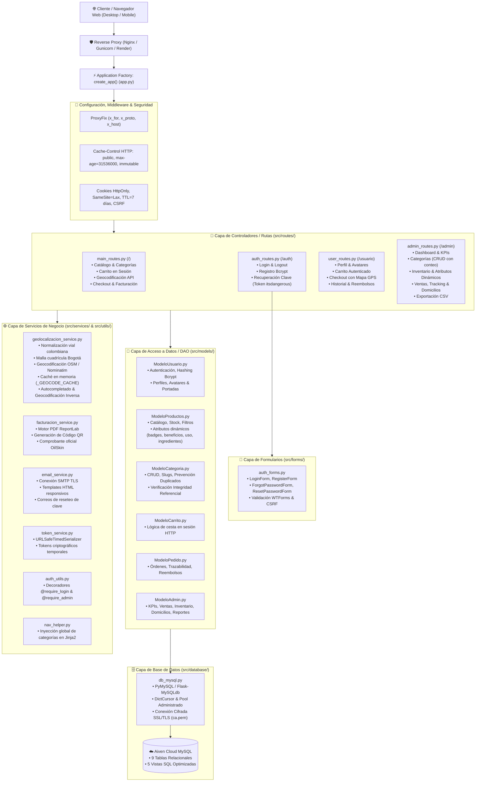
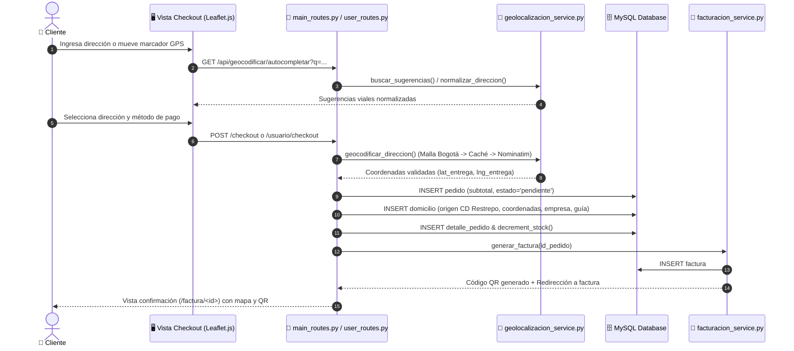
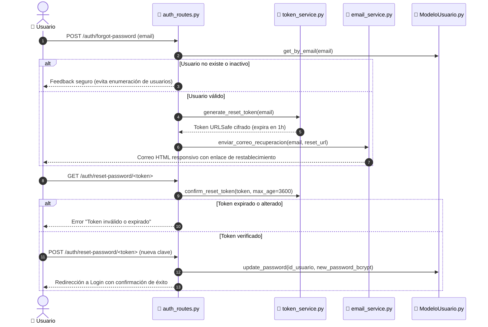
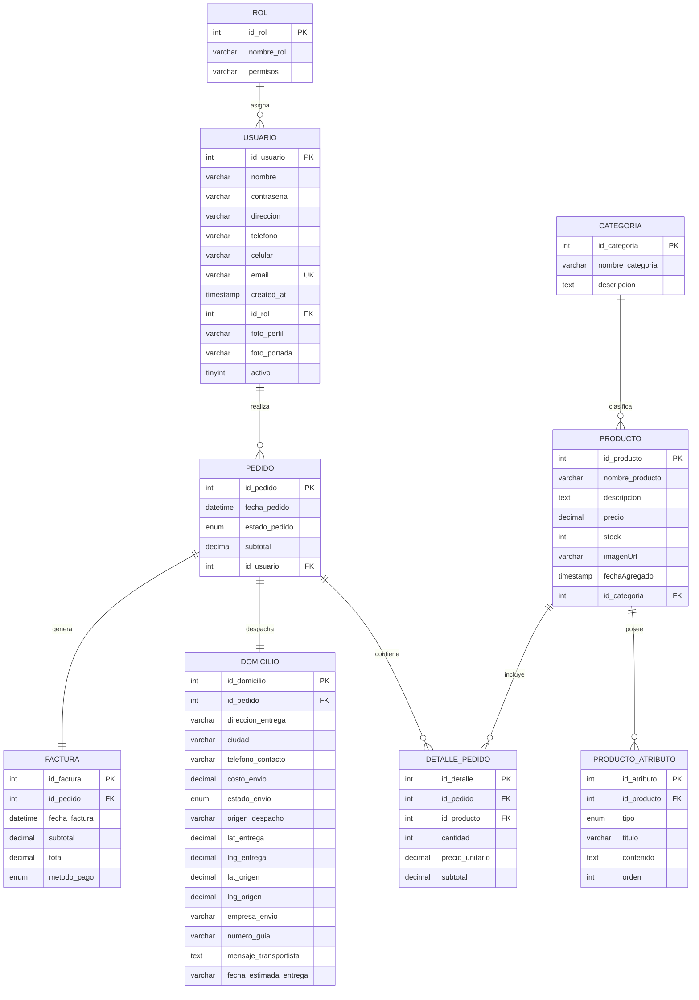

# 📁 Estructura del Código del Proyecto - OilSkin

Este documento contiene un análisis técnico exhaustivo, la arquitectura de software, el mapa de endpoints, el modelo de datos y la representación visual de la estructura del proyecto **OilSkin**, una plataforma e-commerce de productos cosméticos, botánicos y dermatológicos desarrollada con **Python (Flask)**, **MySQL (Aiven Cloud)**, **Jinja2**, **Tailwind CSS v4**, **Flowbite**, **Leaflet.js** y **ReportLab**.

---

## 📐 Análisis Arquitectónico

La aplicación implementa el patrón arquitectónico **MVC (Modelo-Vista-Controlador)** desacoplado mediante el patrón **Application Factory** y **Flask Blueprints**, complementado con una **Capa de Servicios Especializados** (Geolocalización, Facturación PDF, Correo Transaccional SMTP y Seguridad Criptográfica), garantizando modularidad, mantenibilidad y alta escalabilidad.

### 🏛️ Diagrama Global de la Arquitectura



---

### 🔄 Flujos Críticos de la Aplicación

#### 1. Flujo de Compra & Logística con Geolocalización Inteligente


#### 2. Flujo de Recuperación de Contraseña con Tokens Temporales


---

### 🔑 Componentes Clave de la Arquitectura:

1. **Patrón Application Factory (`create_app`)**:
   - Definido en [`app.py`](file:///c:/Users/The%20Tilin%27t/Desktop/OilSkin%20-%20Official%20Repo/app.py).
   - Inicializa la aplicación Flask con rutas absolutas a carpetas estáticas y de plantillas.
   - Conecta el pool de MySQL con soporte SSL TLS para Aiven Cloud mediante [`db_mysql.py`](file:///c:/Users/The%20Tilin%27t/Desktop/OilSkin%20-%20Official%20Repo/src/database/db_mysql.py).
   - Configura las políticas de seguridad de cookies y sesiones (`SESSION_COOKIE_SAMESITE='Lax'`, `SESSION_COOKIE_HTTPONLY=True`, `permanent_session_lifetime = 7 días`, protección CSRF global con Flask-WTF).
   - Implementa optimización de caché HTTP para recursos estáticos (`Cache-Control: public, max-age=31536000, immutable` para imágenes `.webp`, CSS, JS y fuentes web).
   - Configura [`ProxyFix`](file:///c:/Users/The%20Tilin%27t/Desktop/OilSkin%20-%20Official%20Repo/app.py#L44) para garantizar compatibilidad con proxies inversos en producción (Gunicorn, Nginx, Render, Heroku).
   - Registra los 4 Blueprints modulares con prefijos bien definidos (`/`, `/auth`, `/usuario`, `/admin`).

2. **Capa de Controladores / Rutas (`src/routes/`)**:
   - Dividida en 4 Blueprints independientes:
     - [`main_routes.py`](file:///c:/Users/The%20Tilin%27t/Desktop/OilSkin%20-%20Official%20Repo/src/routes/main_routes.py): Catálogo de productos, filtrado dinámico por categoría (`/categoria/<name>`), vista detallada con productos relacionados y atributos dinámicos (`/producto/<id>`), carrito de compras en sesión (`/carrito`), APIs de geocodificación (`/api/geocodificar/...`), pasarela de checkout (`/checkout`), visualización web de factura con código QR (`/factura/<id>`) y descarga de PDF (`/factura/<id>/pdf`).
     - [`auth_routes.py`](file:///c:/Users/The%20Tilin%27t/Desktop/OilSkin%20-%20Official%20Repo/src/routes/auth_routes.py): Autenticación de usuarios (login con verificación bcrypt y control de cuentas activas/restringidas), registro de clientes, ciclo completo de recuperación de clave mediante token seguro (`/auth/forgot-password` y `/auth/reset-password/<token>`) y cierre de sesión (`/auth/logout`).
     - [`user_routes.py`](file:///c:/Users/The%20Tilin%27t/Desktop/OilSkin%20-%20Official%20Repo/src/routes/user_routes.py): Perfil del cliente (`/usuario/`), edición de datos personales, subida y recorte de avatar y portada (`/usuario/actualizar-imagenes`), carrito autenticado, checkout logístico con GPS interactivo, historial de compras (`/usuario/historial`) y solicitudes de reembolso/cancelación.
     - [`admin_routes.py`](file:///c:/Users/The%20Tilin%27t/Desktop/OilSkin%20-%20Official%20Repo/src/routes/admin_routes.py): Panel de control administrativo con KPIs (`/admin/dashboard`), gestión integral de usuarios (cambio de roles, suspensión y reactivación), administración CRUD de categorías con control de unicidad e integridad referencial (`/admin/categorias`), gestión de inventario con atributos dinámicos (badges, beneficios, uso, ingredientes) y ajuste de stock (`/admin/inventario`), control logístico de ventas con seguimiento de transportista y guías (`/admin/ventas`) y exportación de reportes de ventas a CSV.

3. **Capa de Modelos y Datos (`src/models/` y `src/database/`)**:
   - Conector y pool administrado en [`db_mysql.py`](file:///c:/Users/The%20Tilin%27t/Desktop/OilSkin%20-%20Official%20Repo/src/database/db_mysql.py) mediante `PyMySQL` (`pymysql.install_as_MySQLdb()`) y `Flask-MySQLdb` con soporte SSL mediante certificado de autoridad [`ca.pem`](file:///c:/Users/The%20Tilin%27t/Desktop/OilSkin%20-%20Official%20Repo/ca.pem).
   - Patrón DAO (Data Access Object) con consultas 100% parametrizadas contra inyección SQL:
     - [`ModeloProductos.py`](file:///c:/Users/The%20Tilin%27t/Desktop/OilSkin%20-%20Official%20Repo/src/models/ModeloProductos.py): Catálogo, stock, detalle, imágenes, atributos estructurados (`get_atributos`, `guardar_atributos`) y decremento transaccional de stock.
     - [`ModeloCategoria.py`](file:///c:/Users/The%20Tilin%27t/Desktop/OilSkin%20-%20Official%20Repo/src/models/ModeloCategoria.py): Categorías, slugs, conteo de productos asociados (`get_categorias_con_conteo`), prevención de duplicados (`crear_categoria`, `actualizar_categoria`) y eliminación segura con protección de integridad referencial (`eliminar_categoria`).
     - [`ModeloCarrito.py`](file:///c:/Users/The%20Tilin%27t/Desktop/OilSkin%20-%20Official%20Repo/src/models/ModeloCarrito.py): Operaciones de sesión para agregar, actualizar, decrementar, eliminar y calcular totales del carrito de compras.
     - [`ModeloPedido.py`](file:///c:/Users/The%20Tilin%27t/Desktop/OilSkin%20-%20Official%20Repo/src/models/ModeloPedido.py): Creación y trazabilidad de órdenes, domicilios, historial de compras y gestión de reembolsos.
     - [`ModeloUsuario.py`](file:///c:/Users/The%20Tilin%27t/Desktop/OilSkin%20-%20Official%20Repo/src/models/ModeloUsuario.py): Gestión de credenciales, hashing bcrypt, roles, datos de contacto, foto de perfil, portada y restablecimiento de contraseña.
     - [`ModeloAdmin.py`](file:///c:/Users/The%20Tilin%27t/Desktop/OilSkin%20-%20Official%20Repo/src/models/ModeloAdmin.py): KPIs analíticos, métricas de ventas, stock crítico, control de inventario, auditoría de pedidos, datos de transportista y administración de cuentas de usuario.

4. **Capa de Servicios Especializados (`src/services/`)**:
   - [`geolocalizacion_service.py`](file:///c:/Users/The%20Tilin%27t/Desktop/OilSkin%20-%20Official%20Repo/src/services/geolocalizacion_service.py): Normalización de nomenclatura vial colombiana (`normalizar_direccion`), resolución analítica de cuadrantes cartesianos en Bogotá (`resolver_malla_bogota`), validación de coordenadas dentro de Colombia y Bogotá (`validar_coordenadas`), geocodificación directa (`geocodificar_direccion`), geocodificación inversa (`geocodificar_inverso`), autocompletado en tiempo real (`buscar_sugerencias`) y triple caché en memoria para alto rendimiento.
   - [`facturacion_service.py`](file:///c:/Users/The%20Tilin%27t/Desktop/OilSkin%20-%20Official%20Repo/src/services/facturacion_service.py): Generación de facturas comerciales, registro en base de datos, generación de código QR con enlace de validación y renderizado de documentos PDF de alta calidad con ReportLab.
   - [`email_service.py`](file:///c:/Users/The%20Tilin%27t/Desktop/OilSkin%20-%20Official%20Repo/src/services/email_service.py): Envío de correos electrónicos transaccionales mediante SMTP (Gmail u otros proveedores) con diseño HTML responsivo bajo la identidad visual de OilSkin para la recuperación segura de contraseñas.

5. **Capa de Formularios y Validaciones (`src/forms/`)**:
   - [`auth_forms.py`](file:///c:/Users/The%20Tilin%27t/Desktop/OilSkin%20-%20Official%20Repo/src/forms/auth_forms.py): Formularios protegidos con CSRF y validación estricta (`LoginForm`, `RegisterForm`, `ForgotPasswordForm`, `ResetPasswordForm`).

6. **Capa de Utilidades y Seguridad (`src/utils/`)**:
   - [`auth_utils.py`](file:///c:/Users/The%20Tilin%27t/Desktop/OilSkin%20-%20Official%20Repo/src/utils/auth_utils.py): Decoradores `@require_login` y `@require_admin` para la protección de endpoints y control de acceso basado en roles (`id_rol=2` para administradores).
   - [`token_service.py`](file:///c:/Users/The%20Tilin%27t/Desktop/OilSkin%20-%20Official%20Repo/src/utils/token_service.py): Generación y validación criptográfica de tokens temporales con expiración (1 hora) mediante `itsdangerous.URLSafeTimedSerializer`.
   - [`nav_helper.py`](file:///c:/Users/The%20Tilin%27t/Desktop/OilSkin%20-%20Official%20Repo/src/utils/nav_helper.py): Inyección global de categorías y datos de navegación para plantillas Jinja2 y páginas de error.

7. **Herramientas de Diagnóstico y Base de Datos**:
   - [`db_viewer.py`](file:///c:/Users/The%20Tilin%27t/Desktop/OilSkin%20-%20Official%20Repo/db_viewer.py): Herramienta CLI interactiva con formateo tabular (`tabulate`) para inspección, diagnóstico de esquemas, conteo de registros y exportación CSV de la base de datos MySQL en la nube.
   - [`ca.pem`](file:///c:/Users/The%20Tilin%27t/Desktop/OilSkin%20-%20Official%20Repo/ca.pem): Certificado de autoridad SSL para asegurar la comunicación cifrada TLS con el clúster Aiven MySQL.

8. **Capa de Presentación / Vistas (`src/templates/` y `src/static/`)**:
   - Motor de plantillas **Jinja2** modularizado con layouts base (`layout.jinja`, `admin_layout.jinja`, `layout_profile.jinja`, `layout_boostrap.jinja`).
   - Componentes modulares reutilizables para Navbar, Footer, UI Cards y Modales adaptativos.
   - Hojas de estilo procesadas con **Tailwind CSS v4** (`input.css` -> `style.css`), componentes interactivos **Flowbite**, mapas **Leaflet.js** con OpenStreetMap e imágenes estáticas optimizadas en formato moderno **.webp**.

9. **Scripts de Base de Datos (`database/`)**:
   - [`defiv.sql`](file:///c:/Users/The%20Tilin%27t/Desktop/OilSkin%20-%20Official%20Repo/database/defiv.sql): Estructura de tablas relacionales (`rol`, `categoria`, `usuario`, `producto`, `producto_atributo`, `pedido`, `factura`, `domicilio`, `detalle_pedido`) con soporte de geolocalización, trazabilidad logística y atributos dinámicos en cascada.
   - [`vistas.sql`](file:///c:/Users/The%20Tilin%27t/Desktop/OilSkin%20-%20Official%20Repo/database/vistas.sql): Vistas relacionales para catálogo, historial consolidado de pedidos y detalle de productos (`vw_historial_pedidos`, `vw_detalle_pedidos_productos`, `vw_resumen_factura`).
   - [`vistas_admin.sql`](file:///c:/Users/The%20Tilin%27t/Desktop/OilSkin%20-%20Official%20Repo/database/vistas_admin.sql): Vistas analíticas para reportes administrativos, control de stock y cálculo de KPIs (`vw_admin_inventario_ventas`, `vw_admin_resumen_kpis`).
   - [`queries.sql`](file:///c:/Users/The%20Tilin%27t/Desktop/OilSkin%20-%20Official%20Repo/database/queries.sql): Consultas de prueba, verificación y mantenimiento de datos.

10. **Pruebas Automatizadas y Aseguramiento de Calidad (`tests/`)**:
    - [`test_geolocalizacion.py`](file:///c:/Users/The%20Tilin%27t/Desktop/OilSkin%20-%20Official%20Repo/tests/test_geolocalizacion.py): Suite de pruebas unitarias para normalización de nomenclatura vial colombiana, resolución analítica de cuadrantes cartesianos en Bogotá, validación de rangos geográficos, geocodificación directa/inversa y caché en memoria.
    - [`test_panel_admin_mejoras.py`](file:///c:/Users/The%20Tilin%27t/Desktop/OilSkin%20-%20Official%20Repo/tests/test_panel_admin_mejoras.py): Pruebas automatizadas de validaciones y CRUD integral de categorías (prevención de duplicados, restricciones de integridad referencial), almacenamiento relacional de atributos personalizables de producto (`badge`, `beneficio`, `modo_uso`, `ingrediente`) y verificación de seguridad en endpoints administrativos.

---

## 🌳 Árbol de Estructura del Repositorio

```text
OilSkin - Official Repo/
├── .env                              # Variables de entorno locales (DB Aiven, SMTP, Secret Key, Geolocalización)
├── .env.example                      # Plantilla de variables de entorno requeridas
├── .gitignore                        # Archivos y carpetas ignoradas por control de versiones
├── app.py                            # Punto de entrada principal (Application Factory Flask)
├── ca.pem                            # Certificado SSL CA para conexión segura con Aiven Cloud MySQL
├── db_viewer.py                      # Herramienta CLI para visualización y administración de base de datos
├── wsgi.py                           # Punto de entrada para servidores WSGI en producción (Gunicorn)
├── Procfile                          # Configuración de ejecución en plataformas Cloud (Heroku / Render)
├── package.json                      # Scripts y dependencias de frontend (Tailwind CSS CLI v4, Flowbite)
├── package-lock.json                 # Árbol de dependencias bloqueadas de Node.js
├── tailwind.config.js                # Configuración de Tailwind CSS
├── requirements.txt                  # Dependencias de Python / Flask
├── README.md                         # Documentación general y guía de instalación del proyecto
├── ESTRUCTURA_CODIGO.md              # Documentación técnica, arquitectónica y mapa de código fuente
├── LLM.md                            # Guías de comportamiento, límites de edición y flujo para agentes LLM
├── prompt_mejora_geolocalizacion.md  # Especificación de requerimientos de geolocalización y logística
├── prompt_mejora_panel_admin.md      # Especificación de requerimientos para optimización del panel administrativo
├── tmp_checkout_test.py              # Script auxiliar de pruebas para el flujo de checkout
│
├── database/                         # Scripts SQL de estructura, vistas y utilidades
│   ├── defiv.sql                     # Creación de tablas base (rol, categoria, usuario, producto, producto_atributo, pedido, factura, domicilio, detalle_pedido)
│   ├── queries.sql                   # Consultas de prueba, inserciones y mantenimiento
│   ├── vistas.sql                    # Vistas SQL para clientes y catálogo (pedidos, detalles, facturas)
│   └── vistas_admin.sql              # Vistas SQL analíticas para inventario, KPIs y ventas administrativas
│
├── static/                           # Almacenamiento raíz persistente (retrocompatibilidad)
│   └── uploads/
│       └── profiles/                 # Directorio de fotos de perfil (avatares) y banners subidos
│
├── tests/                            # Suite de pruebas automatizadas
│   ├── test_geolocalizacion.py       # Pruebas unitarias de geolocalización, resolución de cuadrantes y caché
│   └── test_panel_admin_mejoras.py   # Pruebas unitarias de categorías (CRUD), atributos dinámicos y protección admin
│
└── src/                              # Código fuente principal de la aplicación Flask
    ├── __init__.py
    │
    ├── database/                     # Conector y configuración de base de datos
    │   ├── __init__.py
    │   └── db_mysql.py               # Configuración de Flask-MySQLdb / PyMySQL con soporte SSL TLS y DictCursor
    │
    ├── forms/                        # Formularios y validaciones con Flask-WTF y WTForms
    │   ├── __init__.py
    │   └── auth_forms.py             # Formularios de Login, Registro, Forgot Password y Reset Password
    │
    ├── models/                       # Modelos de datos y consultas SQL parametrizadas (DAO)
    │   ├── __init__.py
    │   ├── ModeloAdmin.py            # Analítica, KPIs, reportes y gestión de usuarios/inventario/domicilios
    │   ├── ModeloCarrito.py          # Operaciones del carrito de compras en sesión HTTP
    │   ├── ModeloCategoria.py        # Consultas, conteo y CRUD de categorías con prevención de duplicados
    │   ├── ModeloPedido.py           # Creación, trazabilidad, domicilios y reembolsos de pedidos
    │   ├── ModeloProductos.py        # Catálogo, detalles, stock, imágenes y atributos estructurados de productos
    │   └── ModeloUsuario.py          # Cuentas de usuario, hashing bcrypt, fotos de perfil y contraseñas
    │
    ├── routes/                       # Controladores modularizados (Flask Blueprints)
    │   ├── __init__.py
    │   ├── admin_routes.py           # Blueprint `/admin` (dashboards, inventario, categorías, usuarios, ventas, tracking)
    │   ├── auth_routes.py            # Blueprint `/auth` (login, register, forgot-password, reset-password, logout)
    │   ├── main_routes.py            # Blueprint `/` (catálogo, checkout, autocompletado geográfico, facturas, QR)
    │   └── user_routes.py            # Blueprint `/usuario` (perfil, imágenes, carrito, checkout con GPS, pedidos)
    │
    ├── services/                     # Servicios y lógica de negocio especializada
    │   ├── __init__.py
    │   ├── email_service.py          # Envío de correos electrónicos transaccionales SMTP con diseño HTML responsivo
    │   ├── facturacion_service.py    # Generación de comprobantes, códigos QR y facturas PDF con ReportLab
    │   └── geolocalizacion_service.py # Normalización vial colombiana, geocodificación OSM/Nominatim, cuadrantes y caché
    │
    ├── static/                       # Recursos estáticos de la aplicación
    │   ├── css/
    │   │   └── style.css             # Hoja de estilos compilada y optimizada con Tailwind CSS v4
    │   ├── img/                      # Logotipos corporativos, banners e imágenes de marca en formato WebP
    │   ├── src_css/
    │   │   └── input.css             # Archivo fuente con directivas de Tailwind CSS v4 y temas de color
    │   └── uploads/
    │       ├── profiles/             # Carpeta de carga de avatares y portadas de usuarios
    │       └── productos/            # Carga persistente de imágenes de presentación de productos
    │
    ├── templates/                    # Motor de plantillas Jinja2
    │   ├── carrito.jinja             # Vista interactiva del carrito de compras
    │   ├── category.jinja            # Catálogo filtrado por categoría dinámica con imágenes reales de producto
    │   ├── checkout.jinja            # Pasarela de compra con geolocalización, mapa interactivo y selector de entrega
    │   ├── detalle.jinja             # Ficha técnica, badges dinámicos y atributos (beneficios, modo de uso, ingredientes)
    │   ├── error_page.jinja          # Manejador visual de errores HTTP (404, 500)
    │   ├── factura.html              # Plantilla para generación de factura electrónica
    │   ├── index.jinja               # Página de inicio / catálogo principal con banners promocionales
    │   ├── sobre_nosotros.jinja      # Página corporativa, misión, visión y equipo de trabajo
    │   ├── ver_factura.html          # Vista previa web de comprobante con código QR interactivo
    │   │
    │   ├── admin/                    # Vistas del panel de administración
    │   │   ├── admin_layout.jinja    # Layout maestro con sidebar de navegación administrativa, modales y scroll
    │   │   ├── dashboard_categorias.html # Gestión dinámica de categorías del catálogo (creación, edición, eliminación y conteos)
    │   │   ├── dashboard_inventario.html # Gestión integral de stock, precios, carga de imagen con preview y atributos dinámicos
    │   │   ├── dashboard_metricas.html   # Gráficos estadísticos y KPIs financieros/operativos
    │   │   ├── dashboard_usuarios.html   # Control de usuarios, cambio de roles y restricciones
    │   │   └── dashboard_ventas.html     # Reportes de pedidos, actualización de domicilios y tracking con modales optimizados
    │   │
    │   ├── auth/                     # Vistas de autenticación y seguridad
    │   │   ├── forgot_password.jinja # Formulario para solicitar enlace de recuperación de contraseña
    │   │   ├── login.jinja           # Formulario de inicio de sesión con feedback de errores
    │   │   ├── register.jinja        # Formulario de registro de nuevos clientes
    │   │   └── reset_password.jinja  # Formulario para definir nueva contraseña mediante token seguro
    │   │
    │   ├── components/               # Componentes modulares y parciales
    │   │   ├── boostrap/             # Componentes de soporte complementario Bootstrap 5
    │   │   │   ├── _footer_boostrap.html
    │   │   │   ├── _head_boostrap.jinja
    │   │   │   ├── _navbar_boostrap.html
    │   │   │   └── layout_boostrap.jinja
    │   │   └── tailwind/             # Componentes principales basados en Tailwind CSS v4
    │   │       ├── _footer.html      # Pie de página corporativo con enlaces informativos y redes
    │   │       ├── _head_utils.jinja # Metadatos, fuentes tipográficas (Outfit/Inter) y FontAwesome
    │   │       ├── _navbar.html      # Barra superior de navegación responsiva con badge de carrito
    │   │       ├── layout.jinja      # Layout maestro para las vistas públicas de la tienda
    │   │       ├── layout_profile.jinja # Layout base con barra lateral para el área del cliente
    │   │       └── elements/
    │   │           └── ui.jinja      # Macro-componentes y elementos de interfaz de usuario
    │   │
    │   └── profile/                  # Vistas del portal privado del usuario
    │       ├── profile.html          # Perfil de usuario con actualización de datos y carga de imágenes
    │       ├── profile-cart.html     # Carrito de compras contextualizado en la cuenta del usuario
    │       ├── profile-checkout.html # Checkout integrado con geolocalización satelital para clientes autenticados
    │       └── profile-pedidos.html  # Historial de compras, estados de envío y solicitud de reembolsos
    │
    └── utils/                        # Módulos de apoyo, seguridad y middleware
        ├── __init__.py
        ├── auth_utils.py             # Decoradores de autenticación (`@require_login`, `@require_admin`)
        ├── nav_helper.py             # Inyección global de categorías y datos de navegación
        └── token_service.py          # Generador y validador de tokens URLSafe criptográficos (recuperación de contraseña)
```

---

## 🛠️ Tecnologías y Dependencias Principales

### Backend & Seguridad:
- **Python (v3.10+)**: Lenguaje de programación base.
- **Flask (v3.1.3)**: Framework web WSGI modular, extensible y ligero.
- **Flask-MySQLdb (v2.0.0)** & **PyMySQL (v1.2.0)** & **mysqlclient (v2.2.8)**: Conectores relacionales a MySQL con soporte SSL TLS para entornos Cloud (Aiven).
- **mysql-connector-python (v26.7.0)**: Conector oficial utilizado por la herramienta CLI de diagnóstico [`db_viewer.py`](file:///c:/Users/The%20Tilin%27t/Desktop/OilSkin%20-%20Official%20Repo/db_viewer.py).
- **Flask-WTF (v1.3.0)** & **WTForms (v3.2.2)** & **email-validator (v2.3.0)**: Formularios seguros con validación del lado del servidor y protección contra ataques Cross-Site Request Forgery (CSRF).
- **Bcrypt (v5.0.0)**: Algoritmo de hashing criptográfico unidireccional con salt adaptativo para contraseñas de usuarios.
- **itsdangerous (v2.2.0)**: Serialización criptográfica y verificación de tokens con tiempo de expiración (`URLSafeTimedSerializer`) para recuperación de contraseñas.
- **python-decouple (v3.8)** & **python-dotenv (v1.2.2)**: Gestión desacoplada y segura de credenciales mediante variables de entorno (`.env`).
- **Gunicorn (v26.2.0)**: Servidor HTTP WSGI para despliegue de alto rendimiento en producción.
- **ReportLab (v5.0.0)** & **Pillow (v12.3.0)** & **QRCode (v8.2)**: Generación dinámica de comprobantes de pago en PDF y códigos QR de trazabilidad e hipervínculos.
- **tabulate (v0.10.0)**: Formateo visual de tablas en terminal para utilidades CLI de inspección.
- **pytest (v9.1.1)**: Suite para pruebas automatizadas de endpoints y lógica de negocio.

### Frontend & Experiencia de Usuario:
- **Jinja2 (v3.1.6)**: Motor de plantillas del lado del servidor con herencia modular y macros reutilizables.
- **Tailwind CSS (v4.x)**: Framework CSS moderno compilado con `@tailwindcss/cli` para una estética visual oscura (*Dark Mode*) con acentos dorados (`gold: #CEB06E` / `#D4AF37`).
- **Flowbite (v4.0.1)**: Biblioteca de componentes interactivos accesibles construidos sobre Tailwind CSS (menús desplegables, modales, alertas y drawers).
- **FontAwesome 6**: Iconografía vectorial para elementos de navegación, badges de estado y acciones interactivas.
- **Leaflet.js (v1.9.4)**: Mapas interactivos con capas OpenStreetMap para geolocalización satelital, marcadores arrastrables de entrega/despacho y trazado de rutas logísticas.
- **Formato WebP**: Optimización y compresión moderna de imágenes estáticas para máxima velocidad de carga (*Core Web Vitals*).

---

## 🔗 Mapa Completo de Rutas y Endpoints

### 1. Módulo Público / Tienda (`main_blueprint` -> `/`)

| Endpoint | Método HTTP | Función / Controlador | Autenticación | Descripción |
| :--- | :--- | :--- | :--- | :--- |
| `/` | `GET` | `index()` | Pública | Catálogo de productos principal y landing page promocional |
| `/sobre_nosotros` | `GET` | `about()` | Pública | Información corporativa, misión, visión y equipo de trabajo |
| `/producto/<int:id>` | `GET` | `get_product(id)` | Pública | Ficha detallada del producto, badges, atributos dinámicos y artículos sugeridos |
| `/categoria/<string:category_name>` | `GET` | `show_category(category_name)` | Pública | Catálogo filtrado por categoría botánica |
| `/carrito` | `GET` | `carrito()` | Pública | Vista y desglose del carrito de compras |
| `/carrito/agregar` | `POST` | `agregar_al_carrito()` | Pública | Añadir producto al carrito con validación de stock disponible |
| `/carrito/actualizar` | `POST` | `actualizar_carrito()` | Pública | Modificar cantidades de un producto en el carrito |
| `/carrito/eliminar/<int:id_producto>` | `GET`, `POST` | `eliminar_del_carrito(id_producto)` | Pública | Quitar producto del carrito de compras |
| `/api/geocodificar/autocompletar` | `GET` | `api_geocodificar_autocompletar()` | Pública | API de autocompletado en tiempo real con normalización vial y Nominatim |
| `/api/geocodificar/inverso` | `GET` | `api_geocodificar_inverso()` | Pública | API de geocodificación inversa GPS (lat/lng a dirección legible) |
| `/checkout` | `GET`, `POST` | `checkout()` | `@require_login` | Pasarela de compra con geolocalización satelital, origen/destino y pago |
| `/factura/<int:id_factura>` | `GET` | `ver_factura(id_factura)` | Pública | Visualización digital de la factura con código QR interactivo |
| `/factura/<int:id_factura>/pdf` | `GET` | `descargar_factura_pdf(id_factura)` | Pública | Descarga directa del comprobante oficial en formato PDF |

### 2. Módulo de Autenticación (`auth_blueprint` -> `/auth`)

| Endpoint | Método HTTP | Función / Controlador | Autenticación | Descripción |
| :--- | :--- | :--- | :--- | :--- |
| `/auth/login` | `GET`, `POST` | `login()` | Pública | Inicio de sesión con verificación bcrypt y validación de cuenta activa |
| `/auth/register` | `GET`, `POST` | `register()` | Pública | Registro de nuevos clientes con hash seguro y rol de cliente |
| `/auth/forgot-password` | `GET`, `POST` | `forgot_password()` | Pública | Solicitud de recuperación y envío de email transaccional con token |
| `/auth/reset-password/<token>` | `GET`, `POST` | `reset_password(token)` | Pública | Restablecimiento seguro de clave mediante token temporal de 1 hora |
| `/auth/logout` | `GET` | `logout()` | Pública | Cierre de sesión y limpieza de datos en sesión |

### 3. Módulo del Portal de Usuario (`user_blueprint` -> `/usuario`)

| Endpoint | Método HTTP | Función / Controlador | Autenticación | Descripción |
| :--- | :--- | :--- | :--- | :--- |
| `/usuario/` | `GET` | `profile()` | `@require_login` | Panel principal del perfil del usuario autenticado |
| `/usuario/actualizar` | `POST` | `update_profile()` | `@require_login` | Actualización de información personal y datos de contacto |
| `/usuario/actualizar-imagenes` | `POST` | `update_profile_images()` | `@require_login` | Subida a disco de fotos de perfil (avatar) y portada de usuario |
| `/usuario/carrito` | `GET` | `user_cart()` | `@require_login` | Carrito de compras contextualizado dentro de la interfaz del usuario |
| `/usuario/carrito/actualizar` | `POST` | `update_cart_item()` | `@require_login` | Actualización de cantidades de ítems del carrito de usuario |
| `/usuario/carrito/eliminar/<int:id_producto>` | `GET`, `POST` | `delete_cart_item(id_producto)` | `@require_login` | Eliminación de productos del carrito del usuario |
| `/usuario/checkout` | `GET`, `POST` | `user_checkout()` | `@require_login` | Finalización de compra para clientes autenticados con geolocalización |
| `/usuario/historial` | `GET` | `user_history()` | `@require_login` | Consulta de pedidos anteriores, facturas asociadas y tracking de entrega |
| `/usuario/pedido/<int:id_pedido>/reembolso` | `POST` | `solicitar_reembolso(id_pedido)` | `@require_login` | Cancelación de pedido y solicitud de reembolso |

### 4. Módulo de Administración (`admin_blueprint` -> `/admin`)

| Endpoint | Método HTTP | Función / Controlador | Autenticación | Descripción |
| :--- | :--- | :--- | :--- | :--- |
| `/admin/dashboard` | `GET` | `dashboard()` | `@require_admin` | Métricas generales, KPIs analíticos e ingresos consolidados |
| `/admin/usuarios` | `GET` | `usuarios()` | `@require_admin` | Listado completo de usuarios registrados en la plataforma |
| `/admin/usuarios/<int:id_usuario>/rol` | `POST` | `cambiar_rol_usuario(id_usuario)` | `@require_admin` | Asignación de rol (Cliente `id_rol=1` / Administrador `id_rol=2`) |
| `/admin/usuarios/<int:id_usuario>/eliminar` | `POST` | `eliminar_usuario(id_usuario)` | `@require_admin` | Restricción / suspensión de acceso al usuario (`activo=0`) |
| `/admin/usuarios/<int:id_usuario>/reactivar` | `POST` | `reactivar_usuario(id_usuario)` | `@require_admin` | Reactivación de cuenta previamente restringida (`activo=1`) |
| `/admin/categorias` | `GET` | `categorias()` | `@require_admin` | Gestión de categorías con conteo dinámico de productos asociados |
| `/admin/categorias/crear` | `POST` | `crear_categoria()` | `@require_admin` | Creación de nueva categoría con validación de unicidad |
| `/admin/categorias/<int:id_categoria>/editar` | `POST` | `editar_categoria(id_categoria)` | `@require_admin` | Edición de nombre y descripción de categoría |
| `/admin/categorias/<int:id_categoria>/eliminar` | `POST` | `eliminar_categoria(id_categoria)` | `@require_admin` | Eliminación segura verificando que no existan productos vinculados |
| `/admin/inventario` | `GET` | `inventario()` | `@require_admin` | Control y catálogo completo de inventario de productos |
| `/admin/inventario/<int:id_producto>/atributos` | `GET` | `obtener_atributos_producto(id_producto)` | `@require_admin` | API JSON de atributos configurables (badges, beneficios, uso, ingredientes) |
| `/admin/inventario/crear` | `POST` | `crear_producto()` | `@require_admin` | Alta de nuevo producto con imagen y atributos estructurados |
| `/admin/inventario/<int:id_producto>/editar` | `POST` | `editar_producto(id_producto)` | `@require_admin` | Modificación de producto, reemplazo de imagen y guardado de atributos |
| `/admin/inventario/<int:id_producto>/stock` | `POST` | `ajustar_stock(id_producto)` | `@require_admin` | Actualización directa del número de existencias |
| `/admin/inventario/<int:id_producto>/eliminar` | `POST` | `eliminar_producto(id_producto)` | `@require_admin` | Eliminación física del producto del catálogo |
| `/admin/ventas` | `GET` | `ventas()` | `@require_admin` | Panel de órdenes, filtros de estado, recaudación y logística |
| `/admin/ventas/<int:id_pedido>/estado` | `POST` | `cambiar_estado_pedido(id_pedido)` | `@require_admin` | Modificación de estado de orden (`pendiente`, `pagado`, `cancelado`) |
| `/admin/ventas/<int:id_pedido>/domicilio` | `POST` | `actualizar_domicilio_pedido(id_pedido)`| `@require_admin` | Actualización de transportista, guía, estado de envío y coordenadas |
| `/admin/reportes/ventas/exportar` | `GET` | `exportar_reporte_ventas()` | `@require_admin` | Descarga de informe consolidado de ventas en formato CSV |

---

## 🗄️ Modelo de Base de Datos y Vistas SQL

### 1. Tablas Principales (`database/defiv.sql`):



- **`rol`**: Roles del sistema (`id_rol`, `nombre_rol`, `permisos`). `1 = Cliente`, `2 = Administrador`.
- **`categoria`**: Categorías de productos (`id_categoria`, `nombre_categoria`, `descripcion`).
- **`usuario`**: Clientes y administradores (`id_usuario`, `nombre`, `contrasena`, `direccion`, `telefono`, `celular`, `email`, `created_at`, `id_rol`, `foto_perfil`, `foto_portada`, `activo`).
- **`producto`**: Catálogo de cosméticos (`id_producto`, `nombre_producto`, `descripcion`, `precio`, `stock`, `imagenUrl`, `fechaAgregado`, `id_categoria`).
- **`producto_atributo`**: Atributos dinámicos de la ficha técnica (`id_atributo`, `id_producto`, `tipo` ENUM('beneficio','modo_uso','ingrediente','badge'), `titulo`, `contenido`, `orden`). Configurado con `ON DELETE CASCADE` para sincronización con el producto.
- **`pedido`**: Órdenes de compra (`id_pedido`, `fecha_pedido`, `estado_pedido` ENUM('pendiente', 'pagado', 'cancelado'), `subtotal`, `id_usuario`).
- **`factura`**: Comprobantes de pago (`id_factura`, `id_pedido`, `fecha_factura`, `subtotal`, `total`, `metodo_pago` ENUM('efectivo', 'transferencia', 'tarjeta')).
- **`domicilio`**: Logística, despacho y geolocalización satelital (`id_domicilio`, `id_pedido`, `direccion_entrega`, `ciudad`, `telefono_contacto`, `costo_envio`, `estado_envio` ENUM('pendiente','en camino','entregado','cancelado'), `origen_despacho`, `lat_entrega`, `lng_entrega`, `lat_origen`, `lng_origen`, `empresa_envio`, `numero_guia`, `mensaje_transportista`, `fecha_estimada_entrega`).
- **`detalle_pedido`**: Ítems adquiridos por pedido (`id_detalle`, `id_pedido`, `id_producto`, `cantidad`, `precio_unitario`, `subtotal`).

### 2. Vistas de Catálogo y Clientes (`database/vistas.sql`):
- **`vw_historial_pedidos`**: Combina pedidos con facturas y datos completos de domicilio, estados de envío y coordenadas cartográficas para el seguimiento y trazabilidad del cliente.
- **`vw_detalle_pedidos_productos`**: Relaciona el detalle de pedidos con la información descriptiva y el catálogo de cada producto.
- **`vw_resumen_factura`**: Provee información resumida de compras, estado del pedido y datos del usuario comprador para los comprobantes.

### 3. Vistas Analíticas de Administración (`database/vistas_admin.sql`):
- **`vw_admin_inventario_ventas`**: Cruza productos con unidades vendidas acumuladas, ingresos generados y clasificación del estado de inventario (`Bajo Stock` si <= 10, `Stock Normal`, `Stock Abundante` si > 50).
- **`vw_admin_resumen_kpis`**: Agrega métricas consolidadas de órdenes completadas no canceladas, volumen de facturación global y ticket promedio de compra.

---

## ⚙️ Variables de Entorno Requeridas (`.env`)

La aplicación utiliza `python-decouple` y `python-dotenv` para cargar la configuración desde un archivo `.env` en la raíz del proyecto. Las variables requeridas son:

| Variable | Tipo | Valor por Defecto | Descripción |
| :--- | :--- | :--- | :--- |
| `MYSQL_HOST` | String | - | Host del clúster Aiven Cloud MySQL |
| `MYSQL_USER` | String | `avnadmin` | Usuario administrador de la base de datos |
| `MYSQL_PASSWORD` | String | - | Contraseña de conexión a la base de datos |
| `MYSQL_DB` | String | `defaultdb` | Nombre de la base de datos MySQL |
| `MYSQL_PORT` | Entero | `3306` | Puerto de conexión a MySQL |
| `MYSQL_SSL_CA` | Ruta | `ca.pem` | Ruta al certificado de autoridad SSL para cifrado TLS |
| `SECRET_KEY` | String | `dev-secret-key` | Clave secreta para cookies de sesión, tokens itsdangerous y CSRF |
| `MAIL_SERVER` | String | `smtp.gmail.com` | Servidor SMTP para envío de correos |
| `MAIL_PORT` | Entero | `587` | Puerto del servidor SMTP (587 para STARTTLS) |
| `MAIL_USE_TLS` | Booleano | `True` | Habilitar cifrado TLS en conexión SMTP |
| `MAIL_USE_SSL` | Booleano | `False` | Habilitar cifrado SSL directo |
| `MAIL_USERNAME` | String | - | Dirección de correo del remitente SMTP |
| `MAIL_PASSWORD` | String | - | Contraseña de aplicación del correo SMTP |
| `MAIL_DEFAULT_SENDER` | String | `OilSkin <soporte@oilskin.com>` | Nombre visible y dirección del remitente |
| `GEOCODING_PROVIDER` | String | `nominatim` | Proveedor de geocodificación (`nominatim` OpenStreetMap) |
| `GEOCODING_API_KEY` | String | `""` | API Key opcional si se utiliza un servicio de pago |
| `GEOCODING_USER_AGENT` | String | `OilSkin-ECommerce/1.0 (soporte@oilskin.com)` | User-Agent requerido por la política de uso de Nominatim |
| `PORT` | Entero | `5000` | Puerto HTTP en el que corre el servidor Flask |

---

## 🚀 Despliegue y Ejecución

### 1. Ejecución Local (Desarrollo):
```bash
# 1. Crear y activar entorno virtual
python -m venv venv
venv\Scripts\activate  # Windows
source venv/bin/activate  # Linux/macOS

# 2. Instalar dependencias
pip install -r requirements.txt
npm install

# 3. Compilar estilos Tailwind CSS v4
npm run build
# O modo observación en segundo plano:
npm run dev

# 4. Iniciar aplicación Flask
python app.py
```

### 2. Despliegue en Producción:
El repositorio incluye archivos de soporte para despliegues en la nube (Heroku, Render, Railway, VPS):
- **[`wsgi.py`](file:///c:/Users/The%20Tilin%27t/Desktop/OilSkin%20-%20Official%20Repo/wsgi.py)**: Punto de entrada WSGI para Gunicorn (`gunicorn wsgi:app`).
- **[`Procfile`](file:///c:/Users/The%20Tilin%27t/Desktop/OilSkin%20-%20Official%20Repo/Procfile)**: `web: gunicorn wsgi:app --bind 0.0.0.0:$PORT`.
- **`ProxyFix`**: Integrado en `app.py` para asegurar resolución correcta de esquema HTTPS y headers `X-Forwarded-For`.
